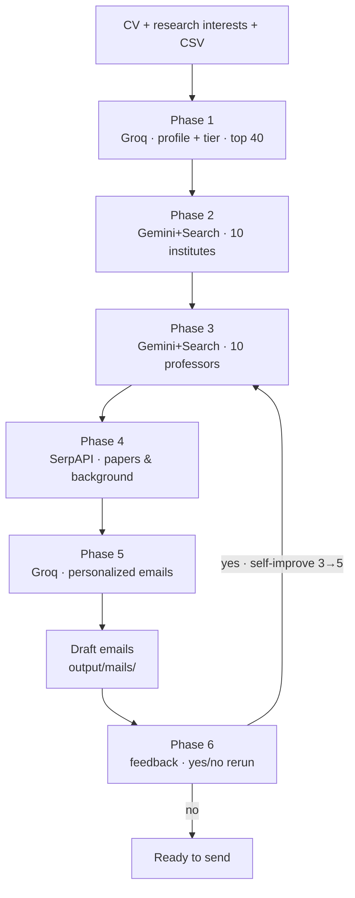

# Ambitio — PhD cold-email pipeline

## Assumptions:
1. Input is all text (Can be modified later to accept input of all formats like PDF etc)
2. The feedback is immediately entered by the student. In a real world scenario, the feedback would be updated after days by students in a persistent database.
3. Only considered 730 institutes in India (will need to be expanded to worldwide for optimized search)
4. No additional restrictions like Visa, travel etc.
5. Only 10 final professors/labs being shortlisted due to rate and token limits of APIs.

## Problem & scope

**Input:** student profile (CV text), research interests in their own words.

**Output:**
- Institutes and professors/labs to target (system picks them — student does not supply names)
- First outbound email draft per professor
---
### Defintion of "Real conversation"
"Real conversation" is when a professor replies with an email indicating genuine interest to accept the student. This could be in the form of admits, referrals, interview calls, scholarships.

### "Would want to work with"

A match the student would wan to pursue if it progressed 
The three ways we defined if a student "would want to work with" a professor are:
1. Research fit — recent work overlaps stated interests (methods + application area).
2. Trajectory fit — keeps targets attainable based on academic qualifications of the student.
3. Practical fit — lab plausibly open (valid email, recent papers, no known “not hiring” / “does not reply” flags from feedback).

Optimization target: fit and hiring likelihood and email quality,not only reply rate. A high reply rate from wrong-field or closed labs would be considered a failure.

---

## Architecture

Six sequential stages. Each reads/writes JSON under `output/` so steps can be rerun independently.



| Phase | Script | What it does |
|-------|--------|----------------|
| **1** | `build_student_profile.py` | Groq structures CV + interests; infers home tier; shortlists **top 40** colleges by reach policy |
| **2** | `select_institutes.py` | Gemini + Search picks **10** target institutes from whitelist; grounded dept/lab URLs |
| **3** | `find_supervisors.py` | Gemini + Search picks **10** professors/labs + emails; applies feedback to drop bad fits |
| **4** | `enrich_candidates.py` | SerpAPI Scholar per professor — recent papers & background for email hooks |
| **5** | `draft_emails.py` | Groq writes one personalized email each; cites papers; applies style feedback |
| **6** | `collect_feedback.py` | Student notes on professors & mail tone → `feedback_store.json` |

**Self-improvement loop:** If the student answers **yes** at Phase 6, phases **3 → 4 → 5** rerun with feedback — professor notes change *who* is targeted; style notes change *how* emails are written.

---

## Why this design

**Obvious decomposition** — Scrape institutions -> Scrape professors -> Scrape their previous work and alignment -> Use this to create personalised emails. Most cold emails fail due to lack of personalisation and generic content. Scraping their previous work and drafting the mail accordingly mitigates that.

**Alternatives considered**

| Alternative | Why not (for MVP) |
|-------------|-------------------|
| Single LLM call for everything | No grounded URLs/emails; high hallucination risk, API limitations |
| Embedding-only professor and institute matchin | Needs a pre-built professor and institute index; Will be slow and less accurate, Will need constant refreshing to maintain updated data, Chances of missing out on some profiles or institutions.  |

---

## Trade-offs

1. **India only vs WorldWide** - Considered only India as a slice of a large scale system. Will need further optimization while scaling to other regions.Indian institutions have a structured T1–T4 tier unavailable globally, reducing hallucination risk in professor discovery. Trade-off: we miss US/UK/Singapore programs many applicants actually target. Will need to refer to a global college index like QS for college tier ranking
1. **Precision over Speed** — First shortlisted institutes before shortlisting labs to ensure best fit professors rather than just one API call which would be faster
2. **Grounded discovery > crawl coverage** — Gemini Search + Serp beats brittle scrapers for a demo slice.
3. **Tier-calibrated reach for realism > maximum institute prestige** —  Ensure realistic targets rather than the professors and labs which are the best in their fields but may be out of reach.
4. **Personalization > Latency** — One extra API call per candidate (SerpAPI) to understand the interests, backgrounds and previous research papers of each candidate. This may not be directly required to shortlist professors but helps a lot in personalisation of mails which will drastically increase the reply rate.
---

## Feedback loop & learning

| Signal | Source | Effect |
|--------|--------|--------|
| Global drafting notes | Student after reading drafts(will be after receiving reply from professor/labs in production scenario) | Injected into email drafting prompts (tone, length, greetings) |
| Per-professor notes | Student (“not taking students”, “interested in ML PhDs”) | Repicking and reranking of candidates based on feedback|
| Files | `output/*.json`, `cli_output.txt` | Audit trail for what changed between runs |

In a production level system, the feedback would be stored in a persistent memory store which would be queried to every time we want to rank the professors and will be updated as in when feedback is entered


---

## What to ship first

**Smallest slice for ~10 real students:**

1. Text CV + research interests (no PDF parser yet).
2. Tier-aware institute whitelist from CSV.
3. Grounded institute + supervisor discovery with emails.
4. Scholar paper snippets for hooks.
5. One draft email per candidate with feedback rerun.

**What we’d measure on those ten students:**

| Metric | Type |
|--------|------|
| % positive reply rate | replies that open real fit discussion |
| % students who would send without changes | Draft quality — send-ready as-is |
| Institute feasibility | % targets within tier/reach policy and grounded whitelist |
| Professor / lab relevancy | Fit/Alignment of chosen supervisors to stated research interests |

---

## How to run

### Prerequisites

- Python 3.11+
- API keys in `.env`:

```env
GROQ_API_KEY=...
GEMINI_API_KEY=...   
SERPAPI_API_KEY=...
```

### Setup

```powershell
python -m venv .venv
.\.venv\Scripts\activate
pip install -r requirements.txt
```

### Inputs

Edit (or replace):

- `samples/profile.txt` — CV / background
- `samples/research_interests.txt` — research statement

`Indian_Engineering_Colleges_Dataset.csv` must be present in the repo root.

### Full pipeline

```powershell
python main.py
```

Logs also written to `cli_output.txt`.

### Run stages individually

```powershell
python build_student_profile.py
python select_institutes.py
python find_supervisors.py
python enrich_candidates.py
python draft_emails.py
python collect_feedback.py
```

To input feedback, answer yes when `collect_feedback.py` prompts or run phase 3-5 again.

### Outputs

| Path | Contents |
|------|----------|
| `output/student_output.json` | Structured profile + tier sample |
| `output/phase2_institutes.json` | Target institutes |
| `output/phase3_candidates.json` | Supervisor candidates + emails |
| `output/phase4_candidates_enriched.json` | + Scholar papers |
| `output/mails/*.txt` | Email drafts |
| `output/feedback_store.json` | User feedback |
| `cli_output.txt` | Full run log |

---

## Failure modes

| Failure | Mitigation in MVP |
|---------|-------------------|
| Hallucinated professor or email | Grounded Gemini prompts; email field from search; manual feedback |
| Gemini empty / non-JSON response | Retries, thought-part extraction |
| Out-of-reach institutes | Institute shortlist before professor shortlisting   |
| Generic emails | Serp paper hooks + per-professor feedback in prompt |
| Closed / unresponsive PIs | Per-professor feedback on rerun |

---

## Sample student

The bundled sample is **Arjun Mehta** — IIT Bombay CSE (CGPA 8.0), healthcare ML / clinical NLP, federated learning. Used to validate end-to-end flow on one realistic Indian PhD applicant profile.

**Outputs:** All pipeline results live under `output/`. Each phase writes an intermediate JSON artifact there (`student_output.json` → `phase2_institutes.json` → `phase3_candidates.json` → `phase4_candidates_enriched.json`), plus final email drafts in `output/mails/`. After feedback, `output/feedback_store.json` is updated and reruns overwrite the later-phase files so you can diff before vs after.

**Run log:** `cli_output.txt` captures the full `main.py` run — phase order, stdout from each script, and interactive feedback prompts — useful for seeing exactly how the pipeline executed.

**Validation on this profile:**
1. Intermediate outputs show tier-appropriate institutes being selected for a T1 (IIT Bombay) student.
2. Self-improvement after feedback works: professors with negative notes (e.g. not taking students, does not reply) drop out of the Phase 3 shortlist on rerun; `phase3_candidates.json` and `output/mails/` differ from the first pass.
3. Mail drafts change on rerun to reflect global style feedback (tone, greetings, length) and updated professor set — compare `output/mails/` and `cli_output.txt` across two runs.
